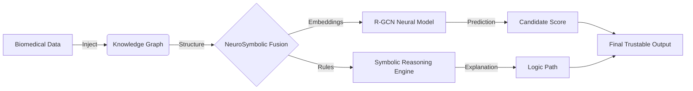

# NeuroPath: Explainable AI for Drug Repurposing

> *Not just predictions — real explanations you can trust.*

**NeuroPath** is a state-of-the-art **NeuroSymbolic AI platform** designed to accelerate drug discovery by identifying new therapeutic uses for existing drugs. Unlike traditional "black-box" AI models that only provide probability scores, NeuroPath combines the predictive power of **Graph Neural Networks (GNNs)** with the transparency of **Symbolic Reasoning** to provide biological justifications for every prediction.

---

## 🚩 Problem Statement

Drug discovery is notoriously **slow, costly, and risky**.
*   **Time**: Developing a single drug takes **10-12 years**.
*   **Cost**: Average R&D cost is **~$2.6 Billion**.
*   **Risk**: **90%** of clinical trials fail due to a lack of biological validation.

**The "Trust Gap"**: Current AI tools (like DeepChem or ChemProp) offer high-performance predictions but lack interpretability. Researchers often cannot trust an AI that says *"Drug X treats Disease Y"* without explaining *how*.

---

## 🧠 Why Neuro-Symbolic?

NeuroPath bridges this gap by fusing two distinct branches of AI:

1.  **Neural (The "Intuition")**: A **Relational Graph Convolutional Network (R-GCN)** analyzes massive biomedical networks to identify hidden patterns and candidate drug-disease links with high accuracy.
2.  **Symbolic (The "Logic")**: A **Symbolic Reasoning Engine (Polo/PyReason)** validates these candidates against explicit biological rules (e.g., *"If Drug A inhibits Protein B, and Protein B causes Disease C, then Drug A treats Disease C"*).

**Result**: We don't just give you a score; we give you a **reason**.

---

## 🏗️ Architecture

The system follows a linear data-to-decision pipeline:



### Core Components
1.  **Data Ingestion**: Aggregates data from Hetionet, DrugBank, and DisGeNET into a Neo4j Knowledge Graph.
2.  **Neural Core**: An R-GCN model predicts top drug candidates.
3.  **Symbolic Engine**: The **Polo Agent** isolates subgraphs and mines logical rules to explain *why* a drug works (e.g., metformins anticancer activity via AMPK/mTOR pathways).
4.  **Explainability Interface**: A React-based frontend visualizes gene heatmaps and pathway logic.

---

## 🚀 Getting Started

### Prerequisites
*   **Neo4j Desktop** (v5.0+)
*   **Python 3.10+**
*   **Node.js 18+**

### 1. Knowledge Graph (The Foundation)
Before running the app, you must build the graph artifacts.
*   👉 **[Go to `finalKG/`](finalKG/README.md)** and follow the build instructions.

### 2. Backend (The Intelligence)
Host the API and Reasoning Engine.
```bash
cd backend
pip install -r requirements.txt
python backend.py
```
*   👉 **[See `backend/README.md`](backend/README.md)** for detailed API docs.

### 3. Frontend (The Interface)
Launch the web dashboard.
```bash
cd frontend
npm install
npm run dev
```

---

## 🔬 Results & Prototype

**Case Study: Metformin for Anti-Cancer**
NeuroPath successfully identified **Metformin** (a Type-2 Diabetes drug) as a candidate for **Cancer treatment**.
*   **Prediction**: High probability score from R-GCN.
*   **Explanation**: The Symbolic Engine revealed the mechanism:
    > *Metformin → activates **AMPK** → inhibits **mTOR** → (mTOR is overactive in breast cancer) → **Anti-cancer activity**.*

---

## 🔮 Future Work

| Feature | Status | Next Steps |
| :--- | :--- | :--- |
| **Gene Influence Heatmap** | 🟡 Partial | Add server-side aggregation for scalability. |
| **LLM Paper Summarization** | 🔴 Planned | Integrate Gemini/OpenAI to summarize PubMed evidence. |
| **Drug Safety Screening** | 🔴 Planned | Analyze side effects and safety signals. |
| **Report Generator** | 🔴 Planned | Export full analysis to PDF/Docx. |
| **Disease Progression** | 🔴 Planned | Show prediction validity over time. |

---

### 👥 Team: Tesla_Curie
*   **Members**: Abhiragini K,Aditya S Mensinkai, Apeksha Datt
